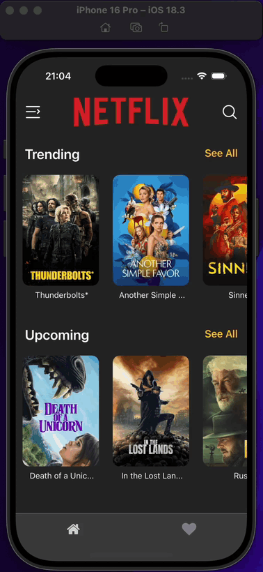
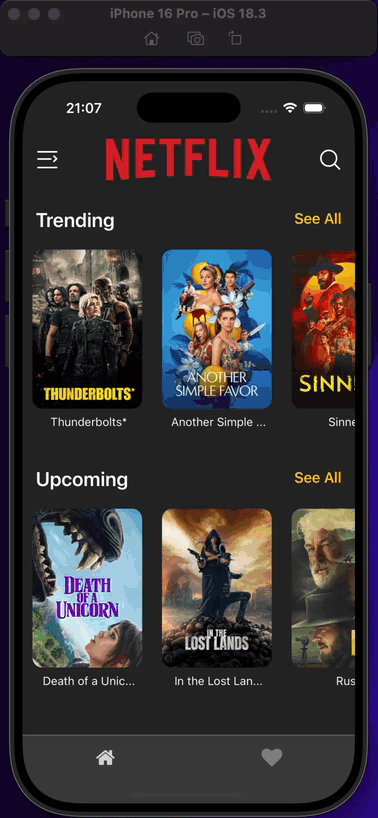
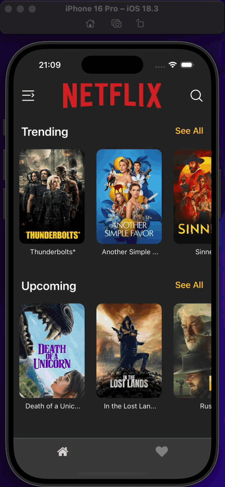
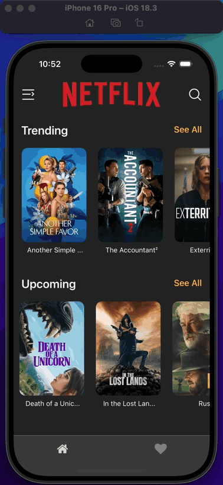

<h1>Netflix Clone App</h1>

This project is a clone of Netflix, a movie application developed with React Native. Application consists of home page, favourites page, search page, movie detail page and actor detail page. Users can view movies on home page. They can search for the movie they want from the search page. From the movie detail page, users can view the movie's statistics, view the actors and add the movie to favourites.

<h2>Used Technologies</h2>

<ul>

<li>@react-navigation/native</li>
<li>@react-navigation/native-stack</li>
<li>@react-navigation/bottom-tabs</li>
<li>@reduxjs/toolkit</li>
<li>axios</li>
<li>nativewind</li>
<li>react-native-linear-gradient</li>
<li>react-native-safe-area-context</li>
<li>react-native-screens</li>
<li>react-native-snap-carousel</li>
<li>react-native-vector-icons</li>
<li>react-redux</li>

</ul>

<h1>Screen Gifs</h1>

